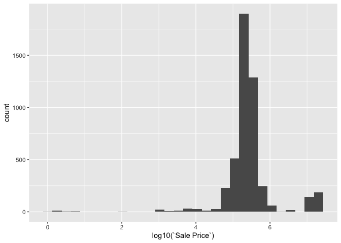
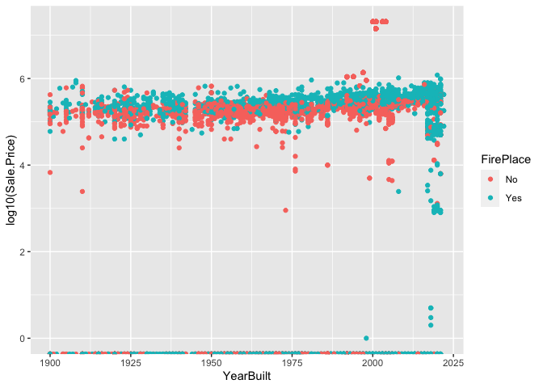
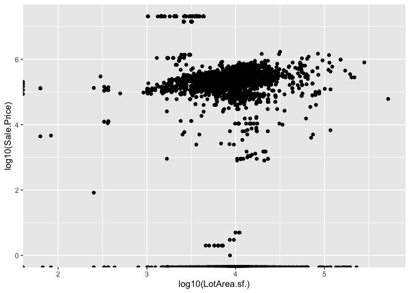

<!-- README.md is generated from README.Rmd. Please edit the README.Rmd file -->

# Lab report \#1

Follow the instructions posted at
<https://ds202-at-isu.github.io/labs.html> for the lab assignment. The
work is meant to be finished during the lab time, but you have time
until Monday evening to polish things.

Include your answers in this document (Rmd file). Make sure that it
knits properly (into the md file). Upload both the Rmd and the md file
to your repository.

All submissions to the github repo will be automatically uploaded for
grading once the due date is passed. Submit a link to your repository on
Canvas (only one submission per team) to signal to the instructors that
you are done with your submission.

``` r
library(ggplot2)
library(classdata)

## import Ames Data
data("ames")
str(ames)
```

    ## tibble [6,935 × 16] (S3: tbl_df/tbl/data.frame)
    ##  $ Parcel ID            : chr [1:6935] "0903202160" "0907428215" "0909428070" "0923203160" ...
    ##  $ Address              : chr [1:6935] "1024 RIDGEWOOD AVE, AMES" "4503 TWAIN CIR UNIT 105, AMES" "2030 MCCARTHY RD, AMES" "3404 EMERALD DR, AMES" ...
    ##  $ Style                : Factor w/ 12 levels "1 1/2 Story Brick",..: 2 5 5 5 NA 9 5 5 5 5 ...
    ##  $ Occupancy            : Factor w/ 5 levels "Condominium",..: 2 1 2 3 NA 2 2 1 2 2 ...
    ##  $ Sale Date            : Date[1:6935], format: "2022-08-12" "2022-08-04" ...
    ##  $ Sale Price           : num [1:6935] 181900 127100 0 245000 449664 ...
    ##  $ Multi Sale           : chr [1:6935] NA NA NA NA ...
    ##  $ YearBuilt            : num [1:6935] 1940 2006 1951 1997 NA ...
    ##  $ Acres                : num [1:6935] 0.109 0.027 0.321 0.103 0.287 0.494 0.172 0.023 0.285 0.172 ...
    ##  $ TotalLivingArea (sf) : num [1:6935] 1030 771 1456 1289 NA ...
    ##  $ Bedrooms             : num [1:6935] 2 1 3 4 NA 4 5 1 3 4 ...
    ##  $ FinishedBsmtArea (sf): num [1:6935] NA NA 1261 890 NA ...
    ##  $ LotArea(sf)          : num [1:6935] 4740 1181 14000 4500 12493 ...
    ##  $ AC                   : chr [1:6935] "Yes" "Yes" "Yes" "Yes" ...
    ##  $ FirePlace            : chr [1:6935] "Yes" "No" "No" "No" ...
    ##  $ Neighborhood         : Factor w/ 42 levels "(0) None","(13) Apts: Campus",..: 15 40 19 18 6 24 14 40 13 23 ...

``` r
summary(ames)
```

    ##   Parcel ID           Address                        Style     
    ##  Length:6935        Length:6935        1 Story Frame    :3732  
    ##  Class :character   Class :character   2 Story Frame    :1456  
    ##  Mode  :character   Mode  :character   1 1/2 Story Frame: 711  
    ##                                        Split Level Frame: 215  
    ##                                        Split Foyer Frame: 156  
    ##                                        (Other)          : 218  
    ##                                        NA's             : 447  
    ##                           Occupancy      Sale Date            Sale Price      
    ##  Condominium                   : 711   Min.   :2017-07-03   Min.   :       0  
    ##  Single-Family / Owner Occupied:4711   1st Qu.:2019-03-27   1st Qu.:       0  
    ##  Townhouse                     : 745   Median :2020-09-22   Median :  170900  
    ##  Two-Family Conversion         : 139   Mean   :2020-06-14   Mean   : 1017479  
    ##  Two-Family Duplex             : 182   3rd Qu.:2021-10-14   3rd Qu.:  280000  
    ##  NA's                          : 447   Max.   :2022-08-31   Max.   :20500000  
    ##                                                                               
    ##   Multi Sale          YearBuilt        Acres         TotalLivingArea (sf)
    ##  Length:6935        Min.   :   0   Min.   : 0.0000   Min.   :   0        
    ##  Class :character   1st Qu.:1956   1st Qu.: 0.1502   1st Qu.:1095        
    ##  Mode  :character   Median :1978   Median : 0.2200   Median :1460        
    ##                     Mean   :1976   Mean   : 0.2631   Mean   :1507        
    ##                     3rd Qu.:2002   3rd Qu.: 0.2770   3rd Qu.:1792        
    ##                     Max.   :2022   Max.   :12.0120   Max.   :6007        
    ##                     NA's   :447    NA's   :89        NA's   :447         
    ##     Bedrooms      FinishedBsmtArea (sf)  LotArea(sf)          AC           
    ##  Min.   : 0.000   Min.   :  10.0        Min.   :     0   Length:6935       
    ##  1st Qu.: 3.000   1st Qu.: 474.0        1st Qu.:  6553   Class :character  
    ##  Median : 3.000   Median : 727.0        Median :  9575   Mode  :character  
    ##  Mean   : 3.299   Mean   : 776.7        Mean   : 11466                     
    ##  3rd Qu.: 4.000   3rd Qu.:1011.0        3rd Qu.: 12088                     
    ##  Max.   :10.000   Max.   :6496.0        Max.   :523228                     
    ##  NA's   :447      NA's   :2682          NA's   :89                         
    ##   FirePlace                            Neighborhood 
    ##  Length:6935        (27) Res: N Ames         : 854  
    ##  Class :character   (37) Res: College Creek  : 652  
    ##  Mode  :character   (57) Res: Investor Owned : 474  
    ##                     (29) Res: Old Town       : 469  
    ##                     (34) Res: Edwards        : 444  
    ##                     (19) Res: North Ridge Hei: 420  
    ##                     (Other)                  :3622

``` r
dim(ames)
```

    ## [1] 6935   16

``` r
amesDF <- data.frame(ames)
```

1.  Inspect the first few lines of the data set:

- what variables are there? of what type are the variables? what does
  each variable mean? what do we expect their data range to be?

  - There are 16 variables in this data sets

    1.  Parcel ID, character, character with ID. It doesn’t have the
        range.

    2.  Address, character, property address in Ames, IA. It doesn’t
        have the range.

    3.  Style, factor variable, factor variable detailing the type of
        housing. It doesn’t have the range.

    4.  Occupancy, factor variable, factor variable of type of housing.
        It doesn’t have the range.

    5.  Sale Date, date, date of sale. Range: 2017-07-03 - 2022-08-31.

    6.  Sale Price, number, sales price (in US dollar), Range: 0 \$ -
        20500000\$

    7.  Multi Sale, logical value: was this sale part of a package. It
        doesn’t have the range.

    8.  YearBuilt, Integer, year in which the house was built. Range:
        0 - 2022.

    9.  Acres, integer, amount of acres of land. Range: 0-13

    10. Total living area, Sqf of living area. Range 0-6007

    11. Bedrooms, num of bedrooms. Range 0-10

    12. FinishedBsmntArea, Sqf of finished basemnet. Range 10-6500.

    13. LotArea, Sqf of lot size. Range 0-524,000

    14. AC, whether there is AC or not. Yes or No

    15. Fireplace, whether there is a Fireplace or not. Yes or No

    16. Neighborhood, what neighborhood its in, Factor with 42 options

  ``` r
  ## Q2: We are trying to find relationship between diffirent variables and sale price.

  ## Question 3
  ## The range of the sales price is bwtween 0 and 20500000 dollars.
  ggplot(ames, aes(x = log10(`Sale Price`), na.rm=TRUE)) +
  geom_histogram()
  ```

      ## `stat_bin()` using `bins = 30`. Pick better value with `binwidth`.

      ## Warning: Removed 2206 rows containing non-finite values (`stat_bin()`).

  <!-- -->

  ``` r
  print(max(amesDF$Sale.Price, na.rm=TRUE)-min(amesDF$Sale.Price, na.rm=TRUE))
  ```

      ## [1] 20500000

Q4:

- Chen’s section:

  ``` r
  library(dplyr)
  ```

      ## 
      ## Attaching package: 'dplyr'

      ## The following objects are masked from 'package:stats':
      ## 
      ##     filter, lag

      ## The following objects are masked from 'package:base':
      ## 
      ##     intersect, setdiff, setequal, union

  ``` r
  # Finding info of yearbuilt
  years_built <- select(amesDF, YearBuilt) 
  summary(years_built)
  ```

      ##    YearBuilt   
      ##  Min.   :   0  
      ##  1st Qu.:1956  
      ##  Median :1978  
      ##  Mean   :1976  
      ##  3rd Qu.:2002  
      ##  Max.   :2022  
      ##  NA's   :447

  ``` r
  # plot scatter plot with year built and sale price, colored by fireplace.
  ggplot(amesDF, aes(x = YearBuilt, y = log10(`Sale.Price`), na.rm=TRUE, color = FirePlace)) + geom_point() + xlim(1900, 2022)
  ```

      ## Warning: Removed 497 rows containing missing values (`geom_point()`).

  <!-- -->

  As you can see the relationship between Year Built and price is very
  stable. I separated the data by fire place. The houses that has
  fireplace tends to have higher sales prices. But there are some
  outliers even if the house has fireplaces the sale prices is very low,
  and some houses that does not have fireplaces have higher sale prices.

- Gavin’s section:  
  I chose to work with the relationship between the LotArea and the
  price.

``` r
ggplot(amesDF, aes(x= log10(LotArea.sf.), y=log10(`Sale.Price`), na.rm=TRUE)) + geom_point()
```

    ## Warning: Removed 89 rows containing missing values (`geom_point()`).

<!-- -->

We see a somewhat linear relationship when both LotArea and SalePrice
are scaled with log10. This data would need some more cleaning and
preparation to better show this relation. This scatter plot shows a
general trend that as the lot area increases so does the sales price.
There are many outliers to this trend, however, in general the trend is
noticeable and defined.
